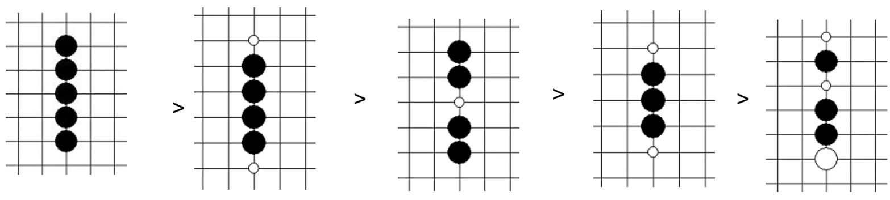
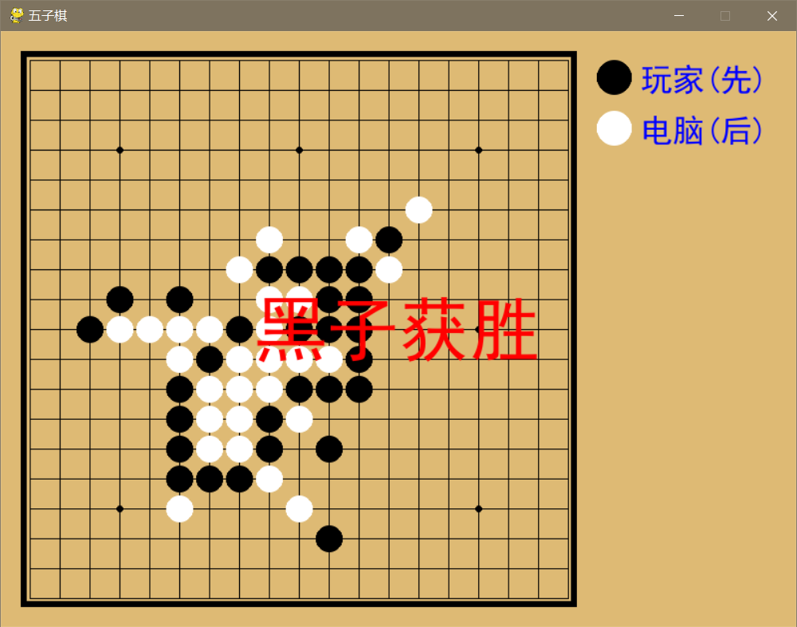

# 五子棋——人机对战

[TOC]

## 项目目标

实现人机对战的五子棋小游戏。

## 算法设计

### 算法思路

在双方每次落子之后对棋局进行评估，判断哪个位置的得分最高，分别判断**共线棋子数**，**共线棋子中是否有空格**和**连续棋子两端是否有阻挡**，分配不同的权重，用记分形式表示，某个位置的得分是横向、纵向和斜向的得分之和，进而判断对玩家或者电脑的利弊，得到最佳的落子位置（算法位于`./chess/play.py`）第177行。



### 优缺点

这样的算法可以使得当前落子是最优的，但是具有一定的局限性，一次落子要么是自己进攻最有利的点，要么是防守最有利的点，不能两者兼顾。

## 项目结构

```
.
├── chess
│   ├── __init__.py
│   ├── chess.py
│   └── play.py
├── img
│   └── win.png
├── main.py
├── README.md
└── requirements.txt

2 directories, 7 files
```

功能函数位于`./chess/play.py`第38行

## 运行结果

玩家（黑棋）先手。一局结束后按`Enter`键进入下一局，棋盘右下角记录战况。


