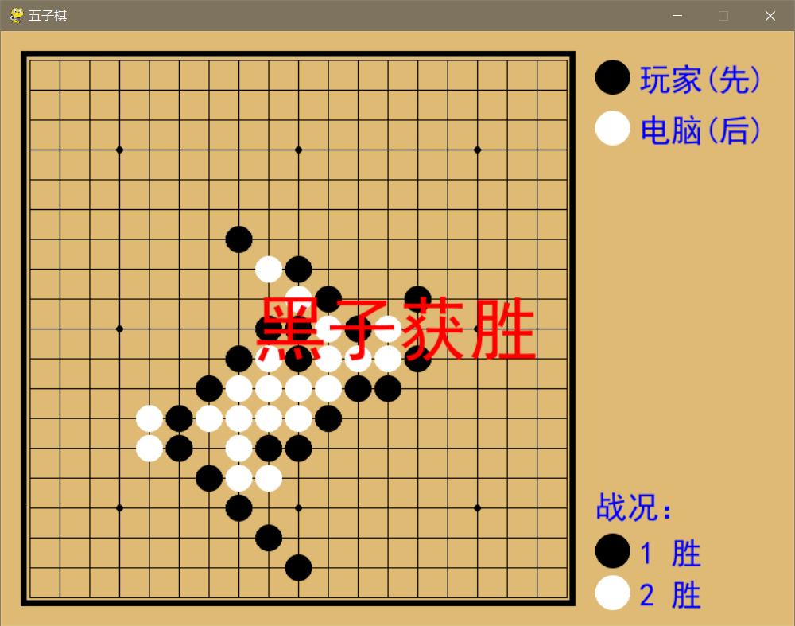

# 五子棋

[TOC]

## 项目目标

实现人机对战的五子棋小游戏。

## 算法设计

在双方每次落子之后对棋局进行评估，分别判断**共线棋子数**，**共线棋子中是否有空格**和**连续棋子两端是否有阻挡**，分配不同的权重，用记分形式表示，进而判断对玩家或者电脑的利弊，得到最佳的落子位置（算法位于`./chess/play.py`）第177行。

## 项目结构

```

```

功能函数位于`./chess/play.py`第38行

## 运行结果


